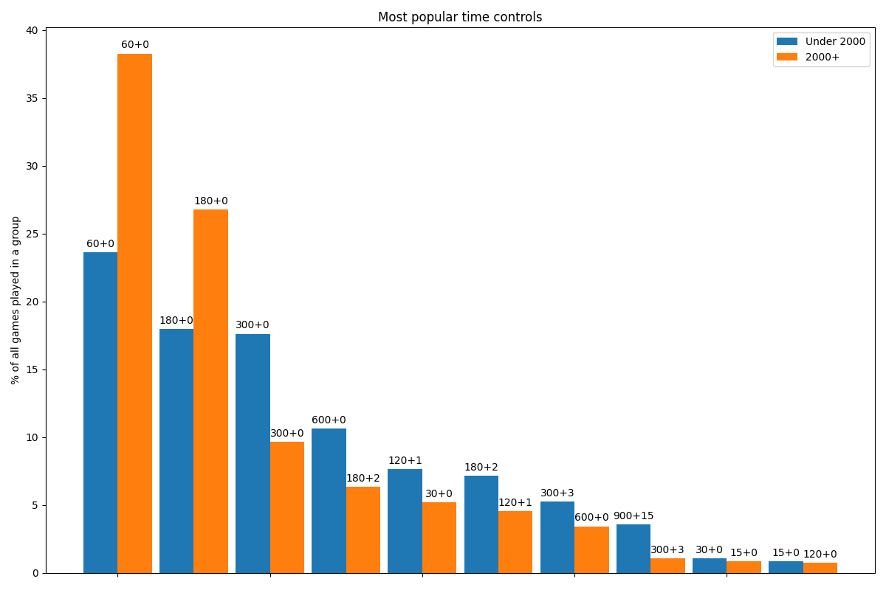
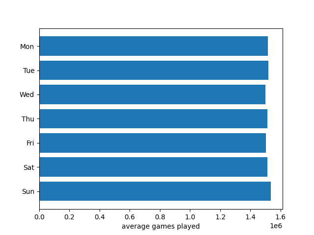

This repository contains scripts and graphs that I did for studying standard rated games of [Lichess games database
](https://database.lichess.org/), in particular games of January and February 2020 (~90 million games).

## Players preferences

### Most popular time controls

Skilled players prefer shorter time controls.

## Chess games

### Win rate vs rating diff

Surprisingly the difference between win chance of playing as black vs playing as white does
not diminish for low-rated players. It's the same 5% as for skilled players.

But rating difference for low-rated players is not as important then it comes to win
chances. 200 points of rating diff mean ~25% chance to win if you are skilled, and ~29% chance
if you are not.

### Blunders

Here I tried to understand how many blunders players do at different skills and time controls.

As blunder I took a move that is more than 200 centipawns weaker than the best posible move calculated by 
chess engine.

It appears that blunders rate is more stable than one would expect. Yes, it goes down with increased 
skill of a player and longer time controls, but not dramatically.

## Some data about Lichess:

### Number of games daily

Daily number of games played is almost constant at 1.5M games a day. Quarantine time with almost
doubled number of players is still ahead.

### Number of games on a weekdays

There is really no significant differences in number of games played within a week.

### Number of games hourly

A bit misleading graph as y-axis doesn't start from 0. The difference between busiest hour and
less crowded is about 3 times in number of games.